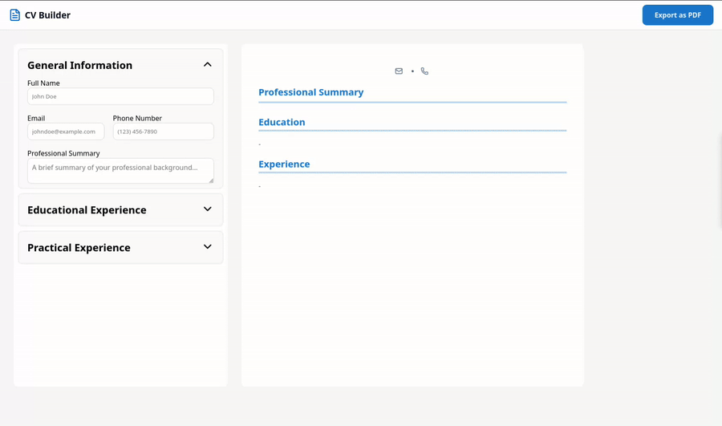
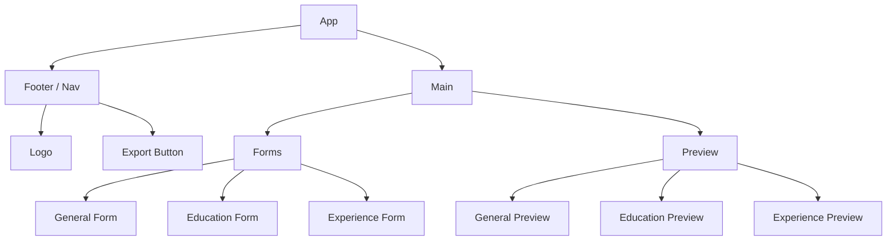
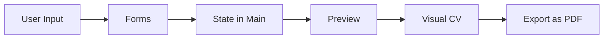
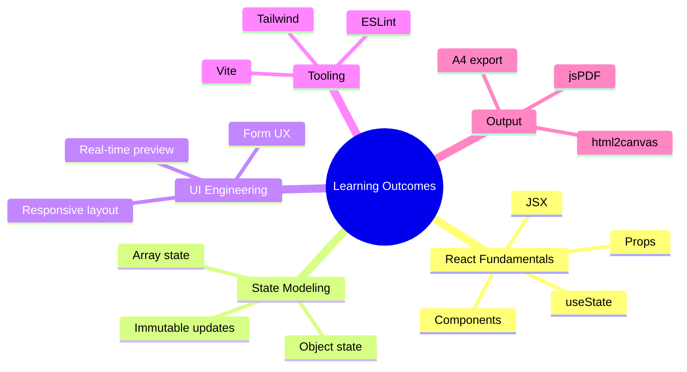

# Odin CV Builder

A React-based CV builder focused on learning component architecture, state flow, and real-time UI previewing.  
The app lets users enter personal, education, and work data, instantly previews the CV, and exports it as a PDF.

Live Demo: [odincvbuilders.vercel.app](https://odincvbuilders.vercel.app/)

---

## Project Showcase




**[Watch full demo video (GitHub raw)](https://github.com/smailoujaoura/odin_cv-builder/raw/main/docs/overview.webm)**


---

## What This Project Does

- Creates a structured CV from user input
- Splits inputs into logical sections: General, Education, Experience
- Supports adding/removing multiple education and experience entries
- Renders a real-time preview while typing
- Exports the preview section to PDF via `html2canvas` + `jsPDF`

---

## Architecture



### State and Data Flow



---

## Technical Highlights

- **Component composition:** clean parent-child structure from `App` to form/preview sub-sections
- **Lifted state:** all core CV state is centralized in `Main` and shared through props
- **Dynamic collections:** education/experience use array state with `id` keys for add/remove workflows
- **Live rendering:** preview mirrors data updates immediately for fast editing feedback
- **Export pipeline:** selected preview node is converted to canvas, then embedded in an A4 PDF

---

## What Was Learned

This project was intentionally built as a learning vehicle for foundational React patterns:

1. **Component design and decomposition**  
   Breaking one large UI into reusable pieces (`Forms`, `Preview`, and section-level components).

2. **Props vs state decisions**  
   Understanding when data should stay local and when it should move upward for shared use.

3. **Managing nested/dynamic form data**  
   Handling arrays of education and experience entries while keeping updates predictable.

4. **UI synchronization**  
   Building confidence in controlled inputs and immediate render feedback.

5. **Styling evolution**  
   Combining existing inline/CSS patterns with Tailwind classes while migrating layout progressively.

---

## Difficulties Encountered

- Choosing where state should live to avoid prop drilling confusion
- Keeping form updates immutable when editing specific array entries
- Handling multiple collapsible sections while preserving clarity in the UI
- Ensuring preview dimensions behave consistently for both screen display and PDF export
- Managing styling consistency during transition from earlier CSS-heavy structure

---

## Optimization Notes

- **State shape simplification:** grouped section fields into clear objects/arrays
- **Stable list behavior:** generated unique ids for repeatable sections (`crypto.randomUUID()`)
- **Single source of truth:** preview reads directly from shared state instead of duplicating logic
- **Focused export target:** using a ref to capture only the preview container for cleaner PDFs
- **Incremental styling strategy:** adopt utility classes where they reduce verbosity without forcing a full rewrite

---

## Academic Value

This project has strong educational value as a bridge from basic JSX to practical front-end engineering:

- Demonstrates component hierarchy planning
- Reinforces one-way data flow and controlled forms
- Applies immutable update patterns for nested structures
- Connects UI work with practical document generation
- Encourages iterative refactoring (from "works" to "maintainable")

### Skills Map



---

## Stack

- React 19
- Vite 7
- Tailwind CSS 4
- `lucide-react` (icons)
- `html2canvas` (DOM-to-canvas capture)
- `jspdf` (PDF creation)

---

## Getting Started

```bash
npm install
npm run dev
```

Open the local development URL shown in your terminal.

### Build for production

```bash
npm run build
npm run preview
```

---

## Suggested Next Enhancements

- Theme controls (color palette and typography presets)
- Layout templates (single-column, two-column CV)
- Reorder entries with drag-and-drop
- Save/load drafts in local storage
- Validation and optional section toggles

---

## Notes

This README was written to document both the software and the learning process behind it.  
It captures architecture, technical trade-offs, and educational outcomes so the project is valuable both as an app and as a study artifact.
